# What drives the price of a car?


**OVERVIEW**

In this application, you will explore a dataset from kaggle. The original dataset contained information on 3 million used cars. The provided dataset contains information on 426K cars to ensure speed of processing.  Your goal is to understand what factors make a car more or less expensive.  As a result of your analysis, you should provide clear recommendations to your client -- a used car dealership -- as to what consumers value in a used car.

### CRISP-DM Framework

<center>
    
</center>


To frame the task, throughout our practical applications we will refer back to a standard process in industry for data projects called CRISP-DM.  This process provides a framework for working through a data problem.  Your first step in this application will be to read through a brief overview of CRISP-DM [here](https://mo-pcco.s3.us-east-1.amazonaws.com/BH-PCMLAI/module_11/readings_starter.zip).  After reading the overview, answer the questions below.

### Business Understanding

From a business perspective, we are tasked with identifying key drivers for used car prices.  In the CRISP-DM overview, we are asked to convert this business framing to a data problem definition.  Using a few sentences, reframe the task as a data task with the appropriate technical vocabulary. 


```python
import pandas as pd
import seaborn as sns
import matplotlib.pyplot as plt
import numpy as np
from sklearn.preprocessing import LabelEncoder
import seaborn as sb 
from sklearn.preprocessing import StandardScaler, PolynomialFeatures
from sklearn.model_selection import train_test_split, GridSearchCV
from sklearn.ensemble import ExtraTreesRegressor, RandomForestRegressor
from sklearn.linear_model import LinearRegression, Ridge
from sklearn.tree import DecisionTreeRegressor
from sklearn import metrics
from sklearn.metrics import mean_squared_error, mean_absolute_error,accuracy_score
from sklearn.metrics import r2_score
import plotly.express as px
from sklearn.model_selection import KFold, cross_val_score
from numpy import sqrt
from sklearn.pipeline import Pipeline
```


```python
df = pd.read_csv("data/vehicles.csv")
```


```python
#a = df['year'].unique()
#print(sorted(a))
#b = df['state'].unique()
#print(sorted(b))
```

### This dataset is of used cars between the years of 1900 - 2022 within United States of America. 
### Used cars often lose their value as the year pass by with the owner. But owner can find out the right value of their car while selling if they have the right information with them.

### Through this analysis, I would like to find out important attributes that drives the price of used cars.

### Keynotes to notice here is to find out the relation between price and condition of the car. How condition of the car depicts price of the car, followed by year, location , other car details like odometer and number of cylinders used.


### It is important to find out the patterns in car sales and predict used car's price.

### Data Understanding

After considering the business understanding, we want to get familiar with our data.  Write down some steps that you would take to get to know the dataset and identify any quality issues within.  Take time to get to know the dataset and explore what information it contains and how this could be used to inform your business understanding.


```python
#df.duplicated().sum()

#a = df['manufacturer'].unique()
#print(a)
#a = df['model'].unique()
#print(a)import pandas as pd
#a = df['condition'].unique()
#print(a)
#print(df['cylinders'].unique())
#print(df['fuel'].unique())
#print(df['title_status'].unique())
#print(df['transmission'].unique())
#print(df['drive'].unique())
#print(df['size'].unique())
#print(df['type'].unique())
#print(df['paint_color'].unique())
```

### Below is the data description and also it's datatypes:
ID — Unique ID given to every individual car

Region - The location of a car in the state

Price — Price of used car since there are only states of USA assuming the price is given in US dollar 

Year — The year in which the car was manufactured

Manufacturer — with 42 unique different car companies engaged in the manufacture of automobiles.

Model — The exact model of the car. For example: sierra 1500 crew cab slt.

Condition — The condition of the car; , good, excellent, fair, like new, new, salvage.

Cylinders — The number of cylinders in the car engine ranging from 3 to 12. Also has the ‘other’ category too.

Fuel — There were five types of fuel, ‘diesel’, ‘gas’, ‘electric’, ‘hybrid’ and ‘other’.

Odometer — This is the distance that the car has traveled after it being bought.

Title_Status — The cars also had 6 types of statues; ‘clean’, ‘lien’, ‘rebuilt’, ‘salvage’ , ‘parts only’ and ‘missing’.

Transmission : Car gear is manual, automatic and there is also "other" type field used .

VIN: The personal identifcation of car Vehicle Identification Number

Drive — There are 3 types of drive transmissions; ‘RWD, ‘4WD’ and ‘FWD’. (Rear wheel drive, Four wheel drive and Forward wheel drive.)

Size: The size of the car if it is compact , full-size, mid-size or sub-compact.

Type — This feature identifies if a vehicle is a SUV, mini-van or a truck. There 13 unique values in this feature.

Paint_Color - Color of the car, there are 11 different colors with 1 "custom" color of car is provided in this data set.

State — The state is political territory and is represented in short form in the data set. Like “ar” is used for the state of Arkansas.


```python
df.info()
```

    <class 'pandas.core.frame.DataFrame'>
    RangeIndex: 426880 entries, 0 to 426879
    Data columns (total 18 columns):
     #   Column        Non-Null Count   Dtype  
    ---  ------        --------------   -----  
     0   id            426880 non-null  int64  
     1   region        426880 non-null  object 
     2   price         426880 non-null  int64  
     3   year          425675 non-null  float64
     4   manufacturer  409234 non-null  object 
     5   model         421603 non-null  object 
     6   condition     252776 non-null  object 
     7   cylinders     249202 non-null  object 
     8   fuel          423867 non-null  object 
     9   odometer      422480 non-null  float64
     10  title_status  418638 non-null  object 
     11  transmission  424324 non-null  object 
     12  VIN           265838 non-null  object 
     13  drive         296313 non-null  object 
     14  size          120519 non-null  object 
     15  type          334022 non-null  object 
     16  paint_color   296677 non-null  object 
     17  state         426880 non-null  object 
    dtypes: float64(2), int64(2), object(14)
    memory usage: 58.6+ MB
    

### Data Cleaning is really important part of Data Understanding:
Are there any missing values in dataset?
Are there any duplicates row?


```python
## Id doesn't add any value to our analysis so would like to drop it:
df=df.drop(['id'],axis=1)
```


```python
#df.duplicated().sum() 
df.drop_duplicates(inplace=True)
df.reset_index(drop=True, inplace=True)
df.duplicated().sum()
```


    0


```python
df.isnull().sum()
```


    region               0
    price                0
    year               987
    manufacturer     15228
    model             4685
    condition       141281
    cylinders       150758
    fuel              2468
    odometer          3489
    title_status      6772
    transmission      2069
    VIN             143069
    drive           112507
    size            264889
    type             78893
    paint_color     108819
    state                0
    dtype: int64


```python
df = df[df['year'].notna()]
df = df[df['manufacturer'].notna()]
df = df[df['model'].notna()]
df = df[df['condition'].notna()]
df = df[df['cylinders'].notna()]
df = df[df['fuel'].notna()]
df = df[df['odometer'].notna()]
df = df[df['title_status'].notna()]
df = df[df['transmission'].notna()]
df = df[df['VIN'].notna()]
df = df[df['drive'].notna()]
df = df[df['size'].notna()]
df = df[df['type'].notna()]
df = df[df['paint_color'].notna()]
df.shape[0]
```


    34868


```python
## VIN doesn't add any value to our analysis so would like to drop it:
df=df.drop(['VIN'],axis=1)
```


```python

sns.heatmap(df.isnull(),yticklabels=False,cbar=False,cmap='tab10')
```


    <Axes: >


    
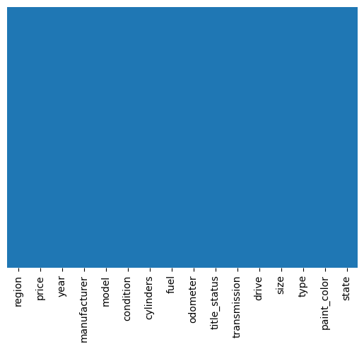
    


```python

```


```python
# plotting target value- price

f, ax = plt.subplots(figsize=(15,8))
sns.distplot(df['price'])

```

    C:\Users\vanib\AppData\Local\Temp\ipykernel_17276\2287117466.py:4: UserWarning: 
    
    `distplot` is a deprecated function and will be removed in seaborn v0.14.0.
    
    Please adapt your code to use either `displot` (a figure-level function with
    similar flexibility) or `histplot` (an axes-level function for histograms).
    
    For a guide to updating your code to use the new functions, please see
    https://gist.github.com/mwaskom/de44147ed2974457ad6372750bbe5751
    
      sns.distplot(df['price'])
    


    <Axes: xlabel='price', ylabel='Density'>


    
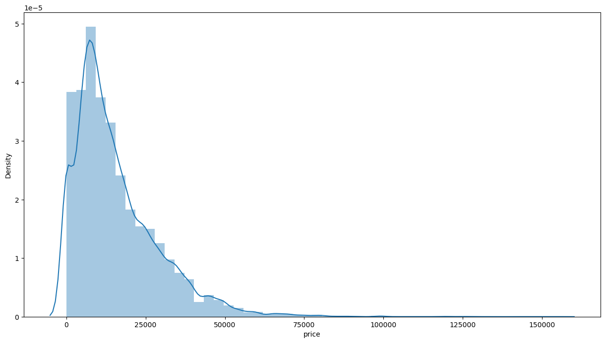
    


```python
#Plotting condition against price
#var = 'condition'
#fig, ax = plt.subplots()
#fig.set_size_inches(11.7, 8.27)
#sns.swarmplot(x = var, y ='price', data = df)
plt.bar(df['condition'],df['price'])
plt.show()
```


    
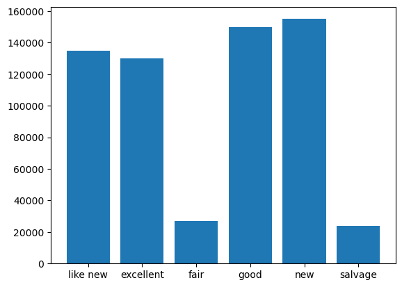
    


```python
#Plotting cylinders against price
#var = 'cylinders'
#fig, ax = plt.subplots()
#fig.set_size_inches(11.7, 8.27)
#sns.swarmplot(x = var, y ='price', data = df)
a4_dims = (11.7, 8.27)
fig, ax = plt.subplots(figsize=a4_dims)
sns.boxplot(x = 'cylinders', y = 'price', data = df,ax=ax) 
```


    <Axes: xlabel='cylinders', ylabel='price'>


    
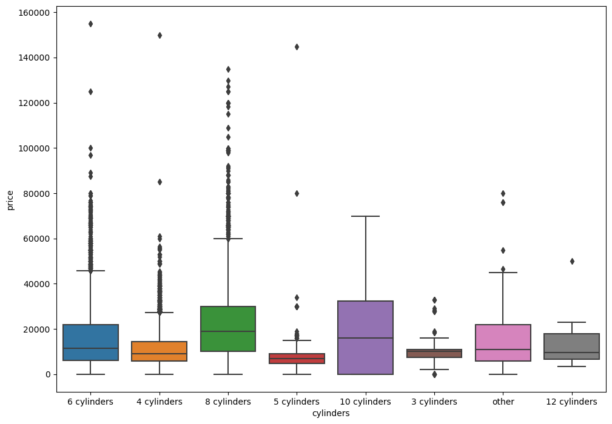
    


```python
#Plotting year against price

#a4_dims = (11.7, 8.27)
#fig, ax = plt.subplots(figsize=a4_dims)
#sns.boxplot(x = 'year', y = 'price', data = df,ax=ax) 
fig = plt.figure(figsize = (11.7, 8.27))
plt.bar(df['year'],df['price'], width=0.8)
plt.show()
```


    
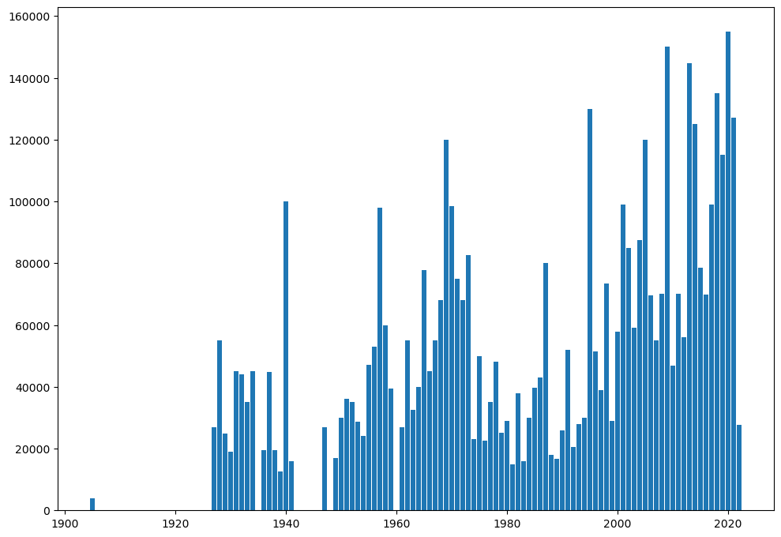
    


```python
#Plotting fuel against price
a4_dims = (11.7, 8.27)
fig, ax = plt.subplots(figsize=a4_dims)
sns.boxplot(x = 'fuel', y = 'price', data = df,ax=ax) 
```


    <Axes: xlabel='fuel', ylabel='price'>


    
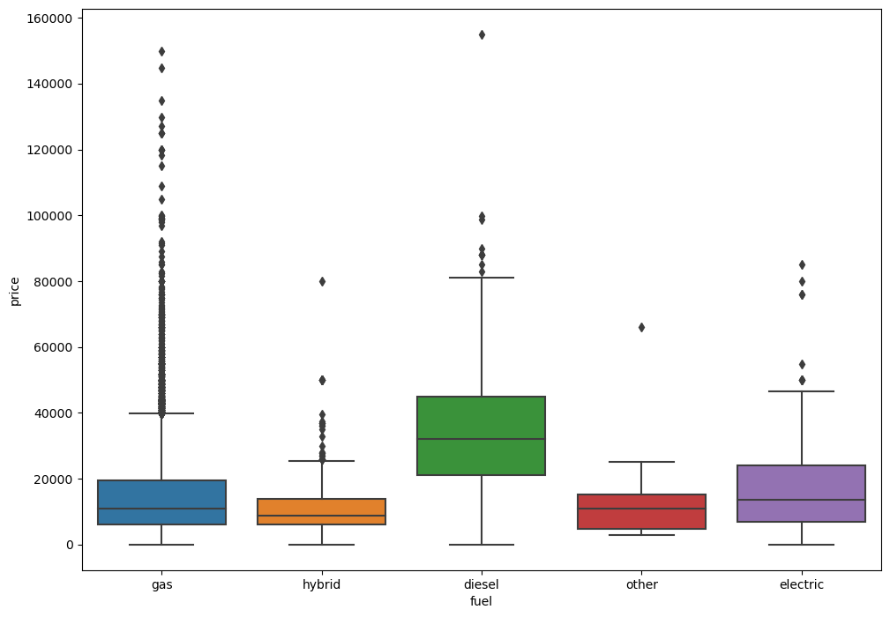
    


```python
#Plotting odometer against price


fig, ax = plt.subplots(figsize=a4_dims)
sns.boxplot(x = 'odometer', y = 'price', data = df,ax=ax) 
```


```python
#Plotting drive against price


fig, ax = plt.subplots(figsize=a4_dims)
sns.boxplot(x = 'drive', y = 'price', data = df,ax=ax) 
```


    <Axes: xlabel='drive', ylabel='price'>


    
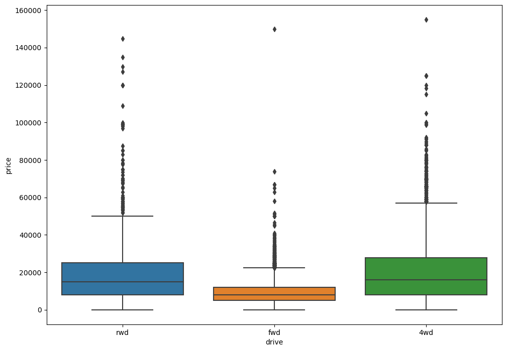
    


```python
#Plotting title_status against price
fig, ax = plt.subplots(figsize=a4_dims)
sns.boxplot(x = 'title_status', y = 'price', data = df,ax=ax) 
```


    <Axes: xlabel='title_status', ylabel='price'>


    
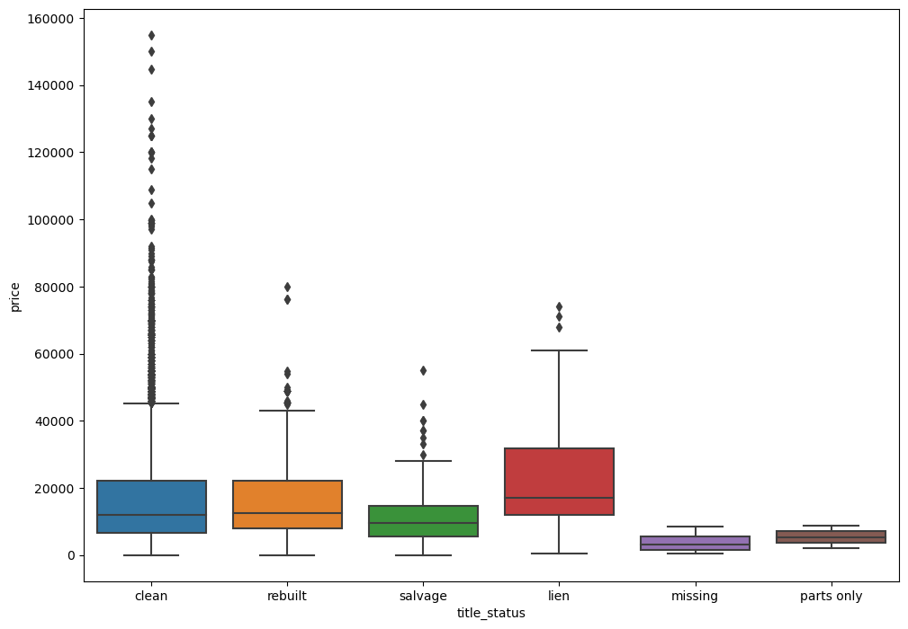
    


```python
#Plotting year against condition


fig, ax = plt.subplots(figsize=a4_dims)
sns.boxplot(x = 'year', y = 'condition', data = df,ax=ax) 
```


    <Axes: xlabel='year', ylabel='condition'>


    
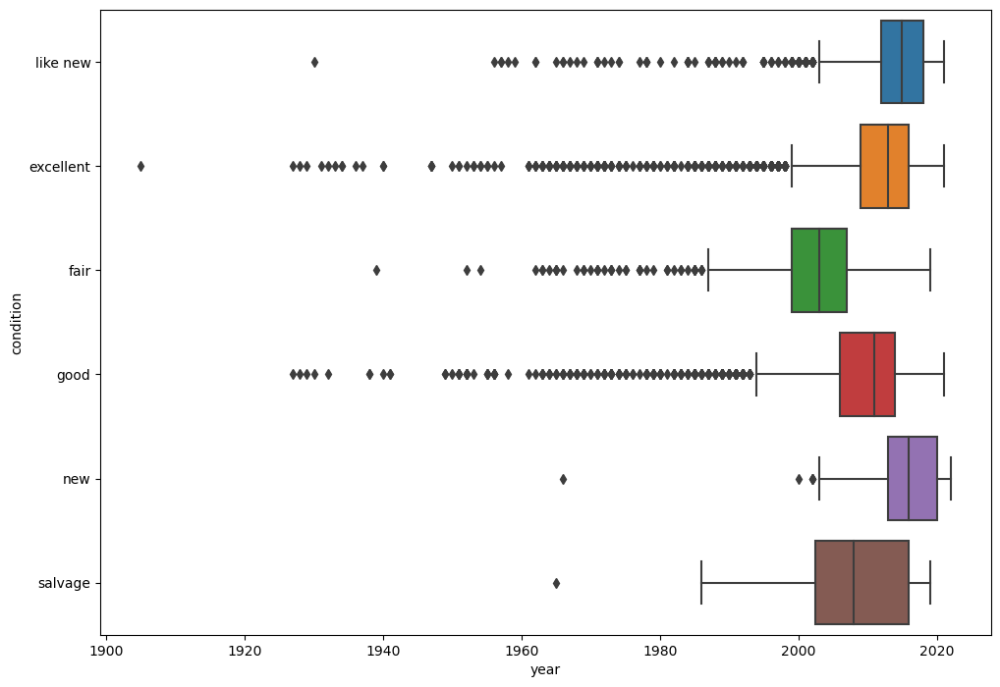
    


### Car condition is directly proportional to newer model, this explains the rise in price against year boxplot as poor condition leads to lower price.


```python
#Plotting state against price


fig, ax = plt.subplots(figsize=a4_dims)
sns.boxplot(x = 'state', y = 'price', data = df,ax=ax) 
```


    <Axes: xlabel='state', ylabel='price'>


    
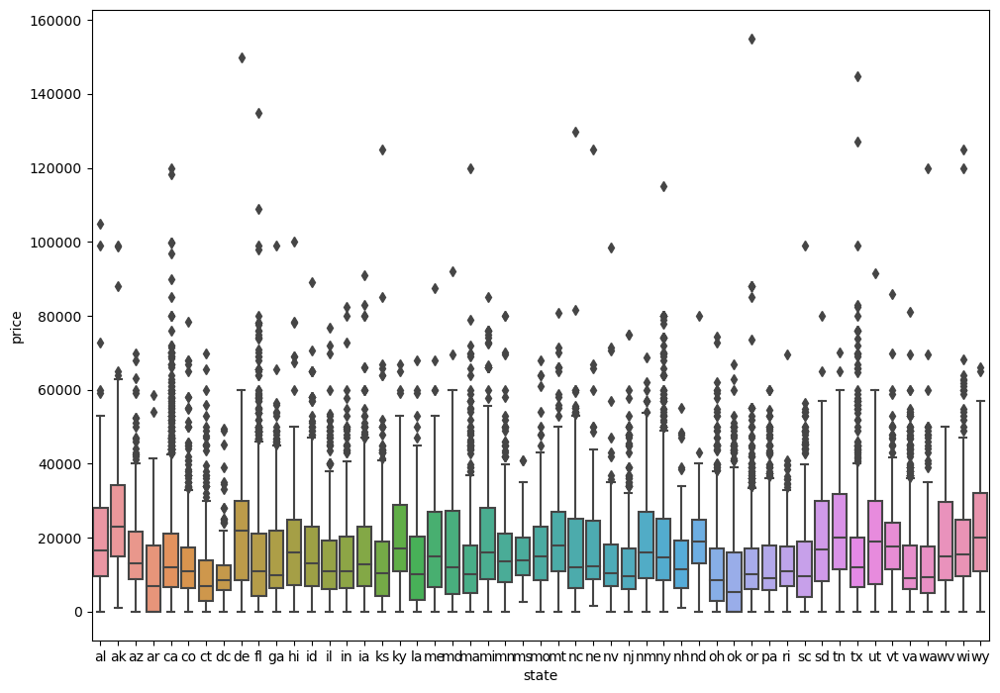
    


```python
#Plotting number of cars sold in a state
#var = 'state'
#var1 = df['state'].value_counts()
#print(var1)
#fig, ax = plt.subplots()
#fig.set_size_inches(11.7, 8.27)
#sns.swarmplot(x = var, y =var1, data = df)

#fig, ax = plt.subplots(figsize=a4_dims)
#sns.barplot(x = 'state', y = var1, data = df) 

df['state'].value_counts().plot(kind='barh',figsize=a4_dims)
```


    <Axes: >


    
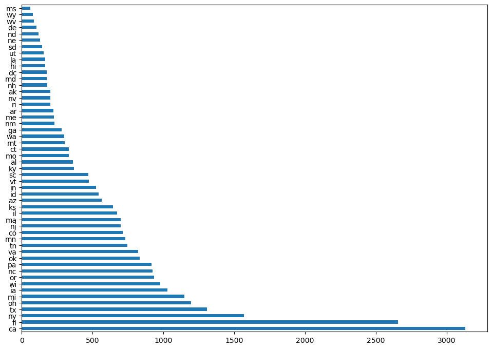
    


### It looks like California and Florida lead the chart in sales of car but the prices of these cars tell a different story


```python
#Plotting number of cars sold for a particular manufacturer
#var = 'manufacturer'
#var1 = df['manufacturer'].value_counts()
#print(var1)
#fig, ax = plt.subplots()
f#ig.set_size_inches(11.7, 8.27)
#sns.swarmplot(x = var, y =var1, data = df)
#fig, ax = plt.subplots(figsize=a4_dims)
##sns.boxplot(x = var, y = var1, data = df,ax=ax) 

df['manufacturer'].value_counts().plot(kind='barh',figsize=a4_dims)
```


    <Axes: >


    
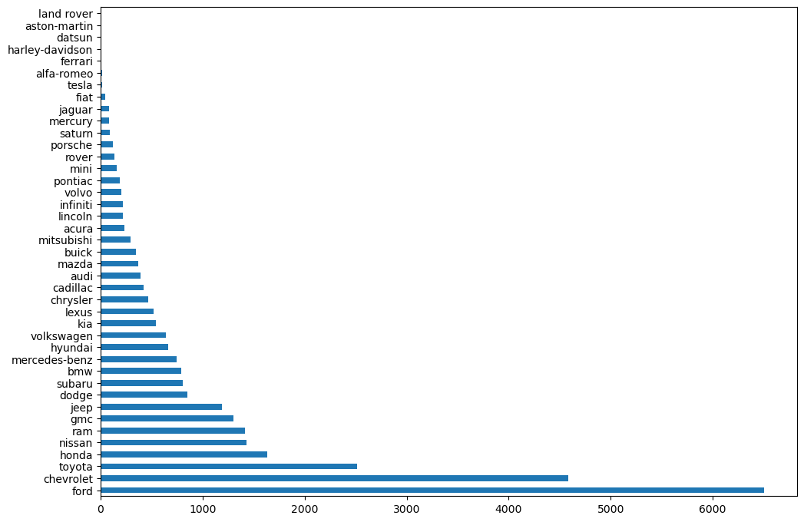
    


### Ford leads with most cars up for sale from a manufacturer. This comes as no surprise since Ford’s F-Series line of pickups have been America’s Best Selling Truck for 43 years straight. For the past 38 years, Ford F-Series trucks have also been the Best Selling Vehicle in America.


```python
f, ax = plt.subplots(figsize=(15,8))
sns.histplot(df['year'],discrete=True,
             color='darkblue', edgecolor='black',
             kde=True, kde_kws={'cut': 2}, line_kws={'linewidth': 4}, bins = 10)
```


    <Axes: xlabel='year', ylabel='Count'>


    
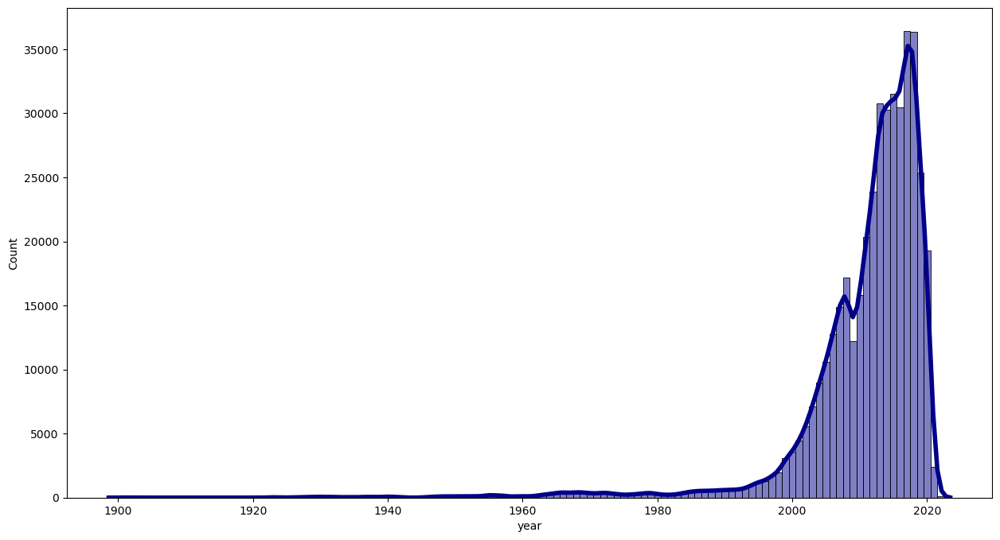
    


```python
#Since region would not add any value independently because fayetteville is in AR vs fayetteville is in NC so keeping only region may create confusion so dropping region and only will keep state for location
df=df.drop(['region'],axis=1)


```

### Data Preparation

After our initial exploration and fine tuning of the business understanding, it is time to construct our final dataset prior to modeling.  Here, we want to make sure to handle any integrity issues and cleaning, the engineering of new features, any transformations that we believe should happen (scaling, logarithms, normalization, etc.), and general preparation for modeling with `sklearn`. 


```python
# Converting categorical columns using label encoder

le = LabelEncoder()

df['cylinders'] = le.fit_transform(df['cylinders'])
df['condition'] = le.fit_transform(df['condition'])
df['manufacturer'] = le.fit_transform(df['manufacturer'])
df['model'] = le.fit_transform(df['model'])
df['fuel'] = le.fit_transform(df['fuel'])
df['transmission'] = le.fit_transform(df['transmission'])
df['title_status'] = le.fit_transform(df['title_status'])
df['drive'] = le.fit_transform(df['drive'])
df['size'] = le.fit_transform(df['size'])
df['model'] = le.fit_transform(df['model'])
df['type'] = le.fit_transform(df['type'])
df['paint_color'] = le.fit_transform(df['paint_color'])
df['state'] = le.fit_transform(df['state'])
```


```python


#print(df.corr())
plt.figure(figsize=(12, 9))
dataplot = sb.heatmap(df.corr(), cmap="YlGnBu", annot=True) 

plt.show() 
```


    
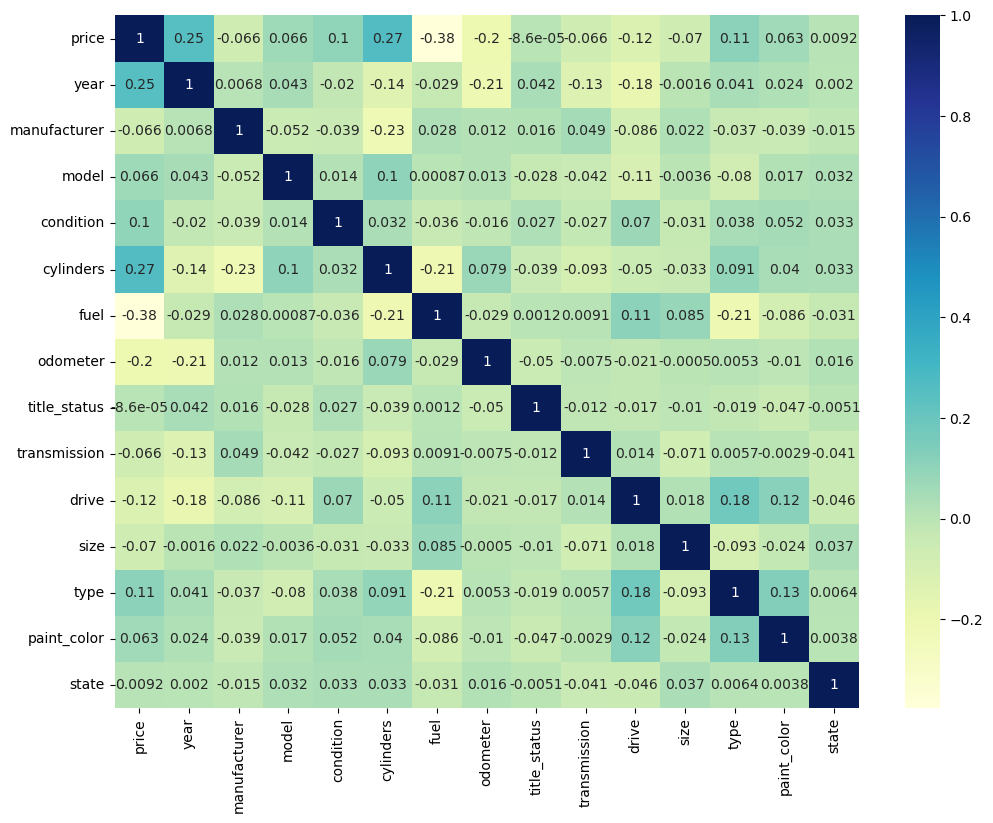
    


### From the Correlation matrix linear relations like the condition of a car and year it was manufactured are clearly visible .Also if a car manufactured at a later year is expected to be in better condition than the cars manufactured in previous years.


```python
# Numerical data typically takes up less memory than categorical data, which can be useful when working with large datasets. Flexibility: Label encoding can be applied to a wide variety of categorical variables, making it a flexible tool in data preprocessing.But has only 1 disadvantage
#It can skew the estimation results if an algorithm is very sensitive to feature magnitude (like SVM). In such case you may consider standardizing or normalizing values after encoding. It can skew the estimation results if there is a large number of unique categorical values
X = df[['year','manufacturer','model','condition','cylinders','fuel','odometer','title_status','transmission','drive','size','type','paint_color','state']]
y = df['price']
X_train, X_test, y_train, y_test = train_test_split(X, y, test_size=0.3, random_state=22)

```


```python
sc = StandardScaler()

```


```python
X_train_norm = sc.fit_transform(X_train)
X_test_norm = sc.transform(X_test)
```

### Modeling

With your (almost?) final dataset in hand, it is now time to build some models.  Here, you should build a number of different regression models with the price as the target.  In building your models, you should explore different parameters and be sure to cross-validate your findings.


```python
selection= ExtraTreesRegressor()
selection.fit(X,y)
plt.figure(figsize = (12,8))
feat_importances = pd.Series(selection.feature_importances_, index=X.columns)
feat_importances.nlargest(20).plot(kind='barh')
plt.show()
```


    
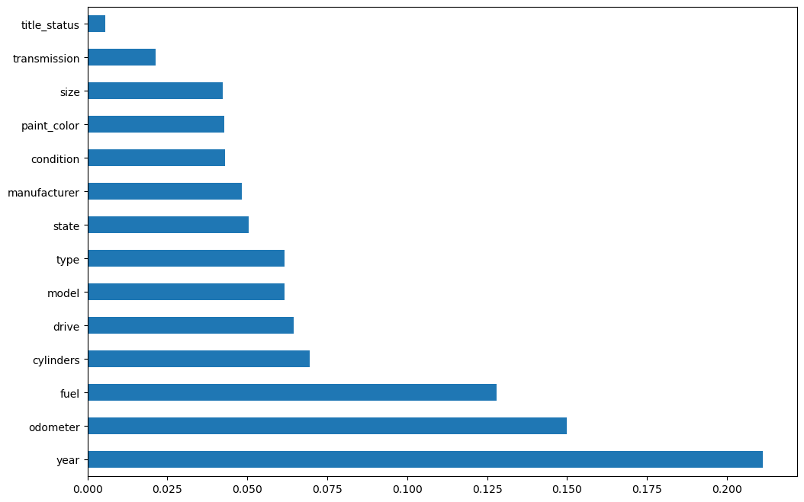
    


```python
training_score = []
testing_score = []
```


```python
linear_reg = LinearRegression()
linear_reg.fit(X_train, y_train)
y_pred= linear_reg.predict(X_test)
print("Accuracy on Traing set: ",linear_reg.score(X_train,y_train))
print("Accuracy on Testing set: ",linear_reg.score(X_test,y_test))
print("Coefficient: ", linear_reg.coef_)
print("Intercept: ", linear_reg.intercept_)
training_score.append(linear_reg.score(X_train,y_train))
testing_score.append(linear_reg.score(X_test,y_test))
```

    Accuracy on Traing set:  0.29333315101393154
    Accuracy on Testing set:  0.3385143125587007
    Coefficient:  [ 4.13952820e+02 -3.27426563e+00  3.35023811e-01  9.78213160e+02
      2.23239924e+03 -7.31752183e+03 -2.02959373e-02 -2.05841847e+02
     -1.55182171e+03 -7.60090993e+02 -5.55752074e+02  4.06516174e+01
      4.78041850e+01 -2.94979439e+00]
    Intercept:  -812176.09717127
    


```python
# Cross Validation K-Fold of Linear Regression

cv = KFold(n_splits=5)

scores_kfold = cross_val_score(linear_reg, X, y,
                         cv=cv)

print(np.mean(abs(scores_kfold)))
#RMSE
print(sqrt(np.mean(abs(scores_kfold))))
```

    0.30319656645847404
    0.550632878112517
    


```python
dec_tre = DecisionTreeRegressor()
dec_tre.fit(X_train, y_train)
y_pred= dec_tre.predict(X_test)
print("Accuracy on Traing set: ",dec_tre.score(X_train,y_train))
print("Accuracy on Testing set: ",dec_tre.score(X_test,y_test))
training_score.append(dec_tre.score(X_train,y_train))
testing_score.append(dec_tre.score(X_test,y_test))
```

    Accuracy on Traing set:  0.9976437983394594
    Accuracy on Testing set:  0.6290711303510335
    


```python
# Cross Validation K-Fold of DecisionTree Regression

cv = KFold(n_splits=5)

scores_kfold = cross_val_score(dec_tre, X, y,
                         cv=cv)
print(np.mean(abs(scores_kfold)))
#RMSE
print(sqrt(np.mean(abs(scores_kfold))))

```

    0.3486577948621915
    0.5904725182954678
    


```python
rf_reg = RandomForestRegressor()
rf_reg.fit(X_train, y_train)
y_pred= rf_reg.predict(X_test)
print("Accuracy on Traing set: ",rf_reg.score(X_train,y_train))
print("Accuracy on Testing set: ",rf_reg.score(X_test,y_test))
training_score.append(rf_reg.score(X_train,y_train))
testing_score.append(rf_reg.score(X_test,y_test))
```

    Accuracy on Traing set:  0.9709941092807391
    Accuracy on Testing set:  0.8125748323499766
    


```python
# Cross Validation K-Fold of RandomForest Regression
cv = KFold(n_splits=5)

scores_kfold = cross_val_score(rf_reg, X, y,
                         cv=cv)
print(np.mean(abs(scores_kfold)))
#RMSE
print(sqrt(np.mean(abs(scores_kfold))))
```

    0.6473140947175556
    0.8045583227569991
    


```python
# I tried doing XGBRegressor but I guess there is an issue with this jupyter dealing with xgboost
```

### the lower the MAE,RMSE the more closely a model is able to predict the actual observations. Cross Validation K-Fold of Linear Regression has the lowest MAE , RMSE out of other models

### Evaluation

With some modeling accomplished, we aim to reflect on what we identify as a high quality model and what we are able to learn from this.  We should review our business objective and explore how well we can provide meaningful insight on drivers of used car prices.  Your goal now is to distill your findings and determine whether the earlier phases need revisitation and adjustment or if you have information of value to bring back to your client.


```python
models = ["Linear Regression","Decision Tree","Random Forest"]
training_score
```


    [0.2916907537406803, 0.9990525259568219, 0.9679438564033265]


```python
testing_score
```


    [0.29699692466016614, 0.5851411907502095, 0.7640150297878943]


```python
model_df = pd.DataFrame({"Algorithm":models, "Training Score":training_score,"Testing Score":testing_score})
model_df
```


<div>
<style scoped>
    .dataframe tbody tr th:only-of-type {
        vertical-align: middle;
    }

    .dataframe tbody tr th {
        vertical-align: top;
    }

    .dataframe thead th {
        text-align: right;
    }
</style>
<table border="1" class="dataframe">
  <thead>
    <tr style="text-align: right;">
      <th></th>
      <th>Algorithm</th>
      <th>Training Score</th>
      <th>Testing Score</th>
    </tr>
  </thead>
  <tbody>
    <tr>
      <th>0</th>
      <td>Linear Regression</td>
      <td>0.291691</td>
      <td>0.296997</td>
    </tr>
    <tr>
      <th>1</th>
      <td>Decision Tree</td>
      <td>0.999053</td>
      <td>0.585141</td>
    </tr>
    <tr>
      <th>2</th>
      <td>Random Forest</td>
      <td>0.967944</td>
      <td>0.764015</td>
    </tr>
  </tbody>
</table>
</div>


```python
#fig = plt.figure(figsize = (10, 5))
 
plt.bar(model_df['Algorithm'],model_df['Testing Score'])
plt.show()
```


    
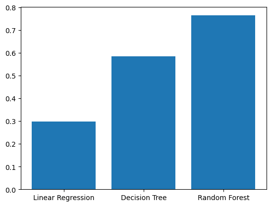
    


```python
#fig = plt.figure(figsize = (10, 5))
 
plt.bar(model_df['Algorithm'],model_df['Training Score'])
plt.show()
```


    
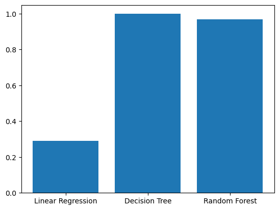
    


```python
# It seems overall Random Forest is best model for this scenario:
final_model = RandomForestRegressor()
final_model = final_model.fit(X_train, y_train)
y_pred = final_model.predict(X_test)
score = r2_score(y_test, y_pred)*100
print(" Accuracy of the model is %.2f" %score)
```

     Accuracy of the model is 76.29
    


```python
print("\t\tError Table")
print('Mean Absolute Error      : ', metrics.mean_absolute_error(y_test, y_pred))
print('Mean Squared  Error      : ', metrics.mean_squared_error(y_test, y_pred))
print('Root Mean Squared  Error : ', np.sqrt(metrics.mean_squared_error(y_test, y_pred)))
print('R Squared Error          : ', metrics.r2_score(y_test, y_pred))
```

    		Error Table
    Mean Absolute Error      :  3359.3079452206744
    Mean Squared  Error      :  44244065.20063046
    Root Mean Squared  Error :  6651.621246029456
    R Squared Error          :  0.764097090642855
    


```python
#px.scatter(x=y_pred,y=y_test)
```


```python
pred_df=pd.DataFrame({'Actual Value':y_test,'Predicted Value':y_pred,'Difference':y_test-y_pred})
pred_df.head(10)
```


<div>
<style scoped>
    .dataframe tbody tr th:only-of-type {
        vertical-align: middle;
    }

    .dataframe tbody tr th {
        vertical-align: top;
    }

    .dataframe thead th {
        text-align: right;
    }
</style>
<table border="1" class="dataframe">
  <thead>
    <tr style="text-align: right;">
      <th></th>
      <th>Actual Value</th>
      <th>Predicted Value</th>
      <th>Difference</th>
    </tr>
  </thead>
  <tbody>
    <tr>
      <th>81275</th>
      <td>14977</td>
      <td>15673.500000</td>
      <td>-696.500000</td>
    </tr>
    <tr>
      <th>93676</th>
      <td>10491</td>
      <td>12587.850000</td>
      <td>-2096.850000</td>
    </tr>
    <tr>
      <th>340146</th>
      <td>6900</td>
      <td>5096.280000</td>
      <td>1803.720000</td>
    </tr>
    <tr>
      <th>250348</th>
      <td>8500</td>
      <td>8119.760000</td>
      <td>380.240000</td>
    </tr>
    <tr>
      <th>74273</th>
      <td>23500</td>
      <td>23927.990000</td>
      <td>-427.990000</td>
    </tr>
    <tr>
      <th>84053</th>
      <td>22200</td>
      <td>17669.363333</td>
      <td>4530.636667</td>
    </tr>
    <tr>
      <th>134043</th>
      <td>13400</td>
      <td>12907.590000</td>
      <td>492.410000</td>
    </tr>
    <tr>
      <th>247856</th>
      <td>14500</td>
      <td>17460.090000</td>
      <td>-2960.090000</td>
    </tr>
    <tr>
      <th>58892</th>
      <td>10995</td>
      <td>13322.700000</td>
      <td>-2327.700000</td>
    </tr>
    <tr>
      <th>5134</th>
      <td>32995</td>
      <td>17704.250000</td>
      <td>15290.750000</td>
    </tr>
  </tbody>
</table>
</div>


## Grid Search CV:


```python
params_dict = {'alpha':np.logspace(-1, 1, 5)}
ridge = Ridge()
grid = GridSearchCV(ridge, param_grid=params_dict)
estimator = ridge
params = grid.get_params()['param_grid']
```


```python
ridge = Ridge()
grid = GridSearchCV(ridge, param_grid=params_dict)
grid.fit(X_train, y_train)
train_preds = grid.predict(X_train)
test_preds = grid.predict(X_test)
train_mse = mean_squared_error(y_train, train_preds)
test_mse = mean_squared_error(y_test, test_preds)
print(grid.best_params_)
print(abs(grid.best_score_))
```

    {'alpha': 10.0}
    0.2776091981779311
    


```python
ridge = Ridge(alpha=10.0)
ridge.fit(X_train, y_train)
second_model = (mean_squared_error(y_true=y,y_pred=ridge.predict(X)))
print(second_model)
```

    125529561.53729117
    

### Deployment

Now that we've settled on our models and findings, it is time to deliver the information to the client.  You should organize your work as a basic report that details your primary findings.  Keep in mind that your audience is a group of used car dealers interested in fine tuning their inventory.

After completing this analysis, I feel like I was able to find answers of my goal I set in the starting of this assignment. Let's begin with hypothesis.

Our hypothesis was that the average price of cars and number of cars available for sale would have an inversely proportional. Important observation was that Florida has relatively cheaper cars than California even though there are more cars for sale in CA then FL. Wyoming which has very few vehicles for sale but has least  prices for cars after West Virginia. Both the cases mentioned above clearly invalidate our hypothesis.

### A decrease in trend in cars available for sale from 2009 show that fewer cars were manufactured in 2009 which can be due to the 2009 financial crisis, the decrease from 2014 onwards can be attributed to temporal proximity to the date the data was collected on. As the cars are already newer users are less likely to sale them ,this is confirmed by the steep decrease from 2015 onwards.

### The linear model gave us a very bad estimate of the prices which it always predicted as lower than the original.

### Atlast we wanted to predict price of a car given the condition it is being sold in , its manufacturer , title_status, drive, mileage and the state it was sold in. 

### As we have seen the accuracy of a trained model is not what we wanted, and it could have been better with some more data so in future while we have more data we can predict of a price so if someone would like to buy used car , they don't end up buying in more than worth price; and same is true for selling too if someone would like to sell car they don't end up getting less price than worth of their car


```python

```


```python

```
